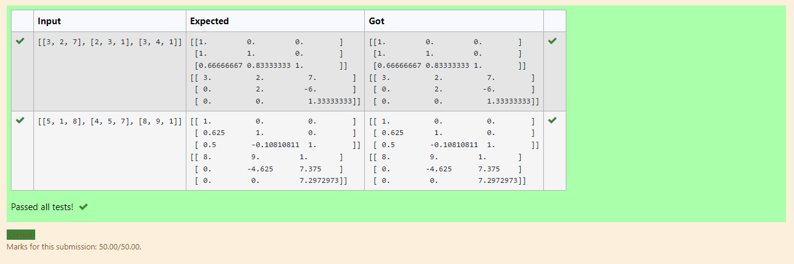
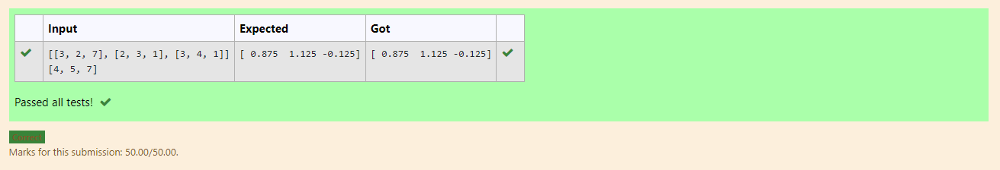

# LU Decomposition without zero on the diagonal

## AIM:
To write a program to find the LU Decomposition of a matrix.

## Equipments Required:
1. Hardware – PCs
2. Anaconda – Python 3.7 Installation / Moodle-Code Runner

## Algorithm
1. Import the numpy module to use the built-in functions for calculation.
2. From scipy.linalg module import the lu function
3. Get inputs from the user and assign the values in np.array().
4. Using the lu() function, we can find the L and U matrix.
5. Print the obtained values.
6. End the program.


## Program:
```
/*
'''Program to find L and U matrix using LU decomposition.
Developed by: A.Virgil Jovita
RegisterNumber: 21500600
'''

# To print L and U matrix
import numpy as np
from scipy.linalg import lu
A=np.array(eval(input()))
P,L,U = lu(A)
print(L)
print(U)
*/
```

## Output:



## Result:
Thus the program to find the LU Decomposition of a matrix is written and verified using python programming.


# Solving a Matrix using LU Decomposition

## AIM:
To write a program to solve a matrix using LU Decomposition

## Equipments Required:
1. Hardware – PCs
2. Anaconda – Python 3.7 Installation / Moodle-Code Runner

## Algorithm
1. Import the numpy module to use the built-in functions for calculation.
2. From scipy.linalg module import lu_factor and lu_solve functions for calculations.
3. Get inputs from the user and assign the values in A and B in np.array().
4. Using the lu_factor(), we can find the LU and pivot.
5. Substitue the value in a variable obtained from lu_solve().
6. Print the variable.
7. End the program.

## Program:
```
'''Program to solve a matrix using LU decomposition.
Developed by: A.Virgil Jovita
RegisterNumber: 21500600
'''
## To print X matrix (solution to the equations)

import numpy as np
from scipy.linalg import lu_factor, lu_solve
A=np.array(eval(input()))
B=np.array(eval(input()))
lu, pivot = lu_factor(A)
x=lu_solve((lu,pivot),B)
print(x)
```

## Output:


## Result:
Thus the program to solve the matrix using LU Decomposition is written and verified using python
programming